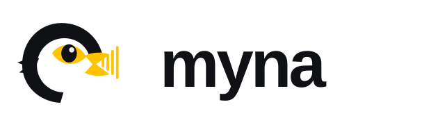

<picture>
  <source media="(prefers-color-scheme: dark)" srcset="myna-brand-kit/myna-logo-horizontal-dark.svg">
  
</picture>

**Capture, transcribe, and summarize your meetings — entirely on your machine.**

[](LICENSE)
[]
[](docs/usage.md)
[](docs/usage.md)
[](LICENSE)

- **[⬇ Download & Install](#getting-started)**
- [Features](#features)
- [Privacy](#privacy-recording--transcription-stay-local)
- [Roadmap](#roadmap)

## Why Myna?

Every meeting deserves a record. The problem is that every tool offering one either sends your call to someone else's servers or parks a bot in your meeting — both feel intrusive. Myna changes that: **it records your meetings locally, transcribes them offline, and summarizes them with AI running on your own hardware.** Nothing leaves your machine. No account. No API calls. No vendor access to your conversations. Just results you own.

## Privacy: Recording & Transcription Stay Local

Myna is built on a simple premise: your meetings are yours alone. Here's what that means in practice:

- **Speech-to-text** runs locally via Parakeet-TDT (ONNX neural net via sherpa-onnx); **no audio is sent to any transcription service**.
- **Summarization** runs locally via Qwen2.5-3B-Instruct (GGUF via embedded llama.cpp); **no transcript leaves your machine**.
- **Recordings, transcripts, and summaries** live in `~/myna/` on your disk (override with `MYNA_DATA_DIR`); **nothing is synced to the cloud**.
- **No telemetry, no analytics, no "improve our service" data collection**.
- **No bot joins your call** — Myna captures from your microphone and system audio; it never participates as a meeting attendee.
- **The only network call in Myna's lifetime is a one-time download** of the AI models from Hugging Face when you first click **Download** in the app (or run `./scripts/download-models.sh`). After that, **it works completely offline.**

**One optional exception: update checks.** Myna can check GitHub once per 24 hours (off by default, opt-in only) to see if a newer version exists. If enabled, the only data sent is your IP address; no meeting data, OS version, or identifiers leave your machine. Myna only *notifies* you of updates; it never downloads or installs them automatically.

**Verify it yourself:** Myna is MIT-licensed and open-source. Read the code. Run it with your network disconnected.

## Free: Really Free

No credit card. No API key. No sign-up. No seat limit. No trial. No usage meter. No paywalled tiers.

Cloud alternatives meter AI compute — "free" plans cap your recording time or summarization credits. Myna meters nothing because there is no server to pay for. Your machine does the work. You own the results.

## Features

### Recording & Capture
- **Three capture modes:** microphone only, system audio only (macOS 14.4+), or microphone + system audio mixed (macOS 14.4+). Gracefully degrades to microphone-only on older macOS versions.
- **Input device selection:** choose which microphone to use; see all available devices.
- **Pause-free recording:** start and stop cleanly; cancel a recording without saving.
- **Permission flow:** requests system audio recording permission when needed; handles permission state (audio-only, no video capture).
- **Live status:** see real-time recording state and transcription progress.

### Transcription
- **Parakeet-TDT v3** speech-to-text (640 MB, int8 ONNX): 25 European languages.
- **Silero-VAD-segmented simulated streaming:** transcription happens in real-time as you speak, with final punctuated results emitted when you pause (~300 ms of silence).
- **Live partial captions:** see transcription appear in the UI as you record.

### Summarization
- **Qwen2.5-3B-Instruct GGUF** via embedded llama.cpp (2.0 GB): one-shot summaries, no streaming service.
- **Template-driven:** four built-in summary types — **Key Points**, **Action Items**, **Meeting Notes**, **Decisions** — plus your own custom templates.
- **Cancellable:** stop summarization mid-generation if needed.
- **Multi-language output:** summarize in your choice of language.

### Summary Templates
- **User-extensible JSON:** add new summary types without recompiling. Template files live in `templates/`; same files drive both CLI and GUI.
- **Built-in templates:** `key-points`, `action-items`, `meeting-notes`, `decisions` (all validated by `schema.json`).
- **Placeholders:** `{transcript}`, `{duration}`, `{title}`, `{language}` — customize prompt logic for your use case.

### Meeting Library
- **List all meetings:** browse recordings with titles, timestamps, and summary status.
- **View transcripts:** read the full meeting transcript.
- **Access summaries:** retrieve saved summaries by template type.
- **Rename meetings:** set human-readable titles.
- **Delete meetings:** remove old recordings and associated data.
- **Export meetings:** save transcripts and summaries to your filesystem.

### App & Models
- **Tauri 2 desktop shell:** Rust core + system webview; small binary, native performance. Currently ships for macOS; Windows and Linux support is on the roadmap.
- **In-app model downloads:** one-click fetch of the AI models with live progress and cancel; see at a glance which models are ready.
- **App version info:** identify your Myna build.

## Getting Started

**Platform support:** Myna is developed and tested on macOS only. Windows and Linux builds are not yet verified — see Roadmap.

### Recommended: Download the .dmg

Grab the latest macOS `.dmg` from
[GitHub Releases](https://github.com/fmflurry/myna/releases),
open it and drag Myna to Applications, then launch.

⚠️ **Important: Unsigned Build** — Myna v0.1.0 is ad-hoc
signed but not notarized (Developer ID pending). macOS will
quarantine the app on first download and may reject it with
*"Myna is damaged and can't be opened."* To allow it to run,
open Terminal and run:

```bash
xattr -dr com.apple.quarantine /Applications/Myna.app
```

Because the build is ad-hoc signed, your code-identity changes
with each release, so **macOS will ask for microphone permission
again after each update**.

### First Launch

On first run, Myna requests system permissions, asks about update checks, and downloads
its AI models:

**Permissions:** You'll see two permission prompts on first
record:

1. **Microphone access** — required for all recordings.
2. **Screen/audio capture** (`kTCCServiceAudioCapture`) —
   appears only if you select system audio or mixed capture
   mode; grants access to record other apps' audio.

**Update checks (optional):** Myna will ask if you'd like it to check GitHub once per day
for new releases. This is off by default and completely optional. If you decline, Myna
works exactly the same way — you'll just need to check GitHub Releases manually.

**Model download:** The onboarding screen shows which models
are ready. Click **Download** and watch live progress; cancel
anytime. This downloads Parakeet-TDT (640 MB), Qwen2.5-Instruct
(2.0 GB), and Silero VAD (629 KB) from Hugging Face — **~2.6 GB
total, one time only**. After the download completes, everything
runs fully offline. Requires macOS 14.4+.

### Build from Source
```bash
npm install
npm --prefix ui install
npx tauri dev
```
Opens the Myna window. Ready to record.

On first run, Myna's onboarding screen shows which models are ready. Click **Download** and watch live progress; cancel anytime. Fetches Parakeet-TDT (640 MB), Qwen2.5-Instruct (2.0 GB), and Silero VAD (629 KB) from Hugging Face (~2.6 GB total, one time). The manual/CLI alternative `./scripts/download-models.sh` still works (idempotent, safe to re-run).

For production builds:
```bash
npx tauri build
```

### Next Steps
See [docs/usage.md](docs/usage.md) for a complete walkthrough: choosing capture sources, recording meetings, generating summaries, and understanding your data storage. [docs/stack-proposal.md](docs/stack-proposal.md) explains why we chose each technology.

## How Myna Compares

| Feature | Myna | Otter.ai | Fireflies.ai | Granola | Fathom | Meetily | MacWhisper |
|---------|------|----------|------------|---------|--------|---------|-----------|
| **Runs on-device** | ✓ | ✗ | ✗ | ✗ | ✗ | ✓ | ✓ |
| **Bot joins call** | ✗ | ✓ | ✓ | ✗ | ✓ | ✗ | ✗ |
| **Account required** | ✗ | ✓ | ✓ | ✓ | ✓ | ✗ | ✗ |
| **Price floor** | Free | Free (300 min/mo, $8.33–16.99/mo+) | Free tier (400 min storage, then $10–18/mo+) | Free basic ($14/user/mo+) | Free (gated AI, $15–20/mo+) | Free CE (PRO tier paywalled) | Free tier (€64 Pro) |
| **License** | MIT | Proprietary | Proprietary | Proprietary | Proprietary | MIT | Proprietary |

**The reality:** several free plans now offer unlimited recording. Myna's edge is **privacy** (nothing leaves your machine) and **zero paywall** (every feature is open). You own your data, full stop.

<sub>Pricing sourced from vendor pages, checked 2026-08:
[Otter.ai](https://otter.ai/pricing) ·
[Fireflies.ai](https://fireflies.ai/pricing) ·
[Granola](https://www.granola.ai/pricing) ·
[Fathom](https://www.fathom.ai/pricing) ·
[Meetily](https://github.com/Zackriya-Solutions/meetily) ·
[MacWhisper](https://www.macwhisper.com/)</sub>

## Roadmap

### Near-term
- **Speaker diarization** — summaries know who said what (paywalled by all cloud rivals).
- **Global search** — find meetings, transcripts, and summaries across your entire library.
- **Export formats** — Markdown, TXT, SRT, VTT, PDF, plus Obsidian and Notion vault exports.
- **Windows & Linux support** — build, test, and full feature parity on non-macOS platforms.
- **Model picker** — choose between 3B, 8B, and larger LLMs based on your hardware.
- **Custom vocabulary** — biasing and hotword support so proper nouns and technical terms transcribe correctly.

### Mid-term
- **Calendar integration** — auto-title meetings from EventKit/ICS; remember attendees.
- **Meeting-app auto-detect** — recognize Zoom/Teams/Meet and auto-record.
- **Chat with your history** — local RAG over past meetings; talk to your own call library.
- **True low-latency streaming** — replace VAD segmentation with proper streaming inference.
- **Whisper fallback** — Whisper-large-v3-turbo for 99-language / CJK coverage.
- **PII redaction** — remove sensitive data before summarization (the one thing cloud vendors structurally cannot do).
- **Community template sharing** — discover and use templates others have built.
- **Transcript editor** — fix transcription errors; scrub back to audio for verification.

### Long-term
- **iOS companion** — record in-person meetings on your phone.
- **Encrypted sync** — backup to storage you own (S3, iCloud, Syncthing); encrypted end-to-end.
- **Speaker enrollment** — identify speakers by voice, not "Speaker 2".
- **Local MCP server** — webhooks and CRM/issue-tracker outbound integrations.
- **Team workspace** — self-hosted collaboration without cloud infrastructure.
- **Meeting analytics** — talk-time, question rates, engagement trends (once diarization is ready).
- **Live captions + offline translation** — overlay subtitles; translate meetings as they happen.

*This roadmap reflects our direction, not a commitment. Priorities shift based on user feedback and technical feasibility.*

## Contributing & License

Myna is released under the **MIT** License — [read it here](LICENSE).

**Third-party model licenses:**
- **Parakeet-TDT model weights** — CC-BY-4.0 (attribution required; credit is included in Myna's source).
- **sherpa-onnx runtime** — Apache-2.0.
- **llama.cpp runtime** — MIT.
- **Qwen2.5-Instruct model** — Qwen research model agreement (see [Hugging Face](https://huggingface.co/Qwen/Qwen2.5-3B-Instruct-GGUF)).

### Resources
- **[Usage Guide](docs/usage.md)** — walkthrough, troubleshooting, export options.
- **[Architecture & Decisions](docs/stack-proposal.md)** — why we chose Tauri, Parakeet, Qwen, and llama.cpp.
- **Source code** — MIT-licensed; read it, run it, modify it.
- **[Developer Notes](docs/adr/)** — architecture decision records.

### Questions?
Open an issue or discussion on the project's repository.

### Built with AI
Myna was built entirely with AI — code, docs, and design. The agent configs, rules, and skills used to build the app are public: [fmflurry/settings-opencode](https://github.com/fmflurry/settings-opencode).

### Support the project
Myna is really free, and that doesn't change here. If the app has exceeded your expectations and you'd like to support development, a donation is purely optional: [paypal.me/fmflorianmichel](https://paypal.me/fmflorianmichel).

Enjoy recording your meetings. Your data is yours alone.
