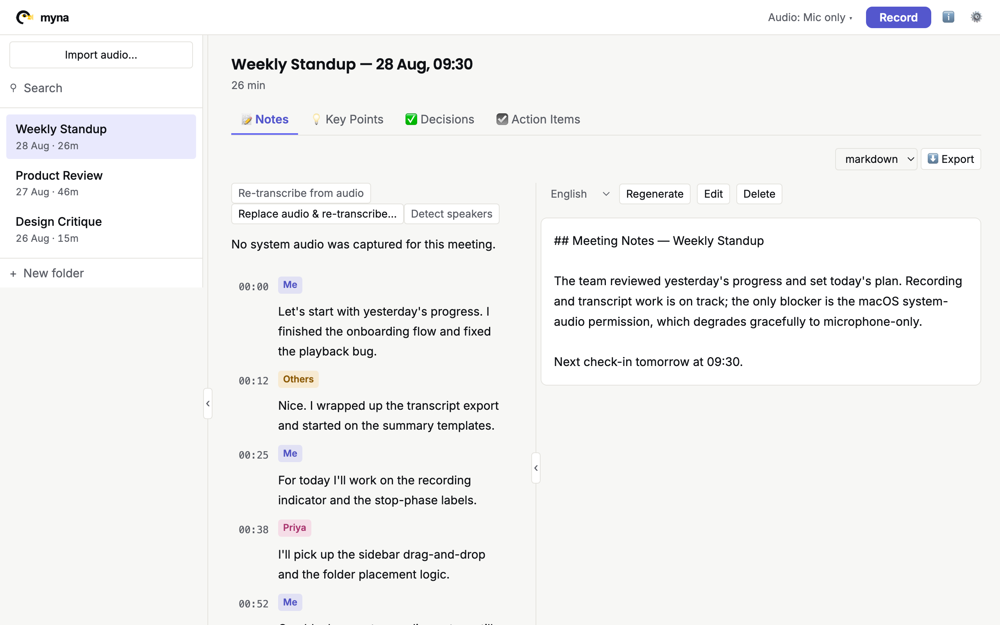
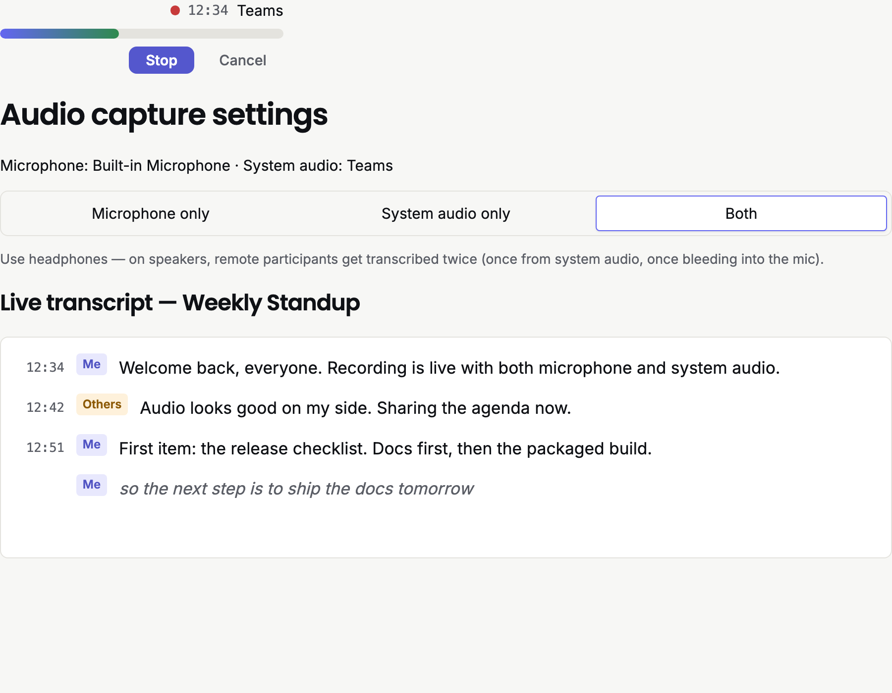
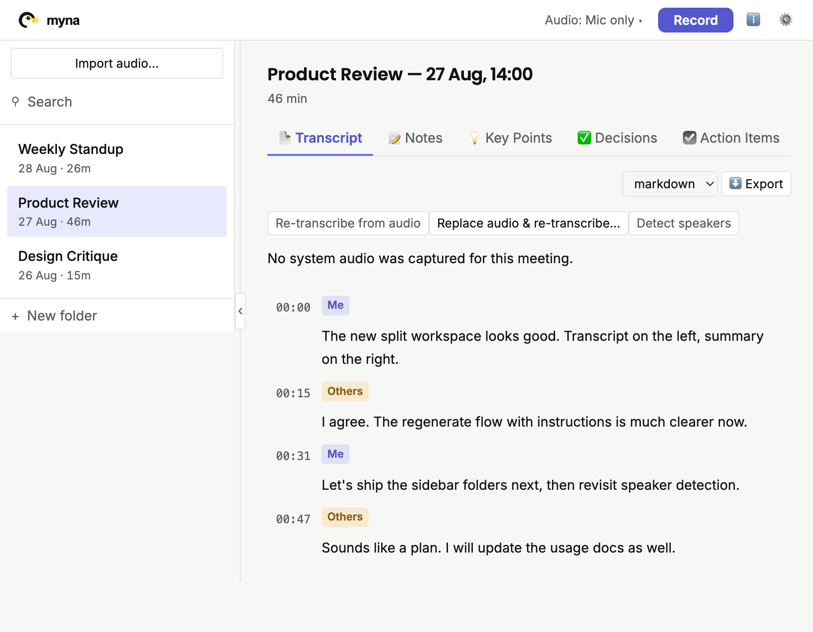
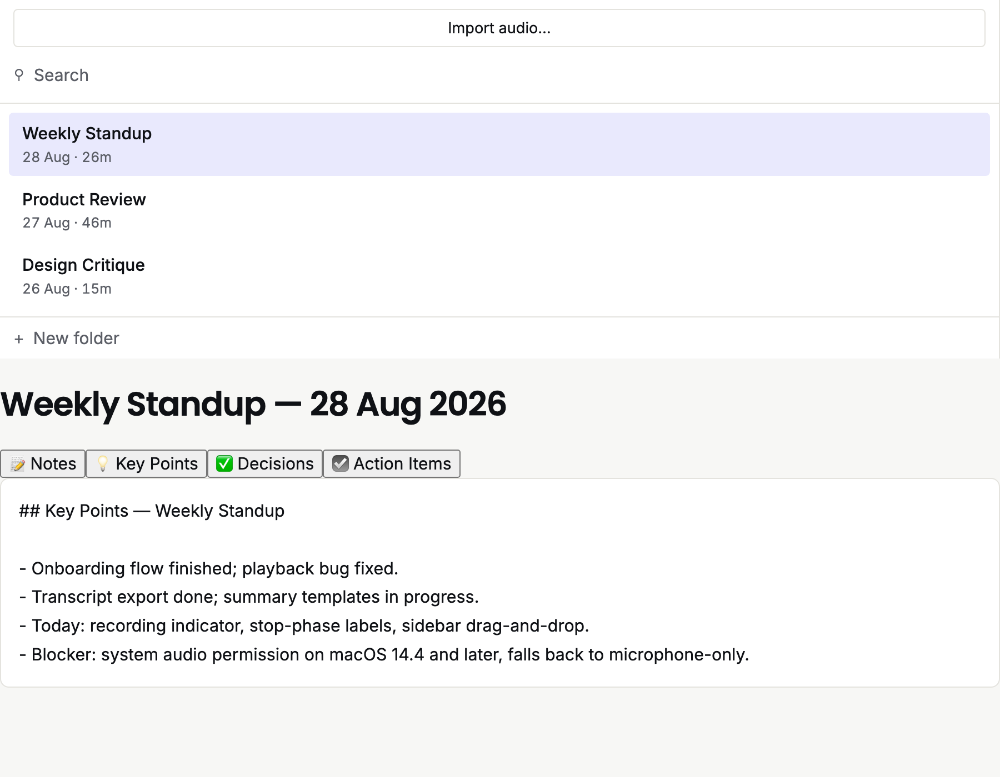
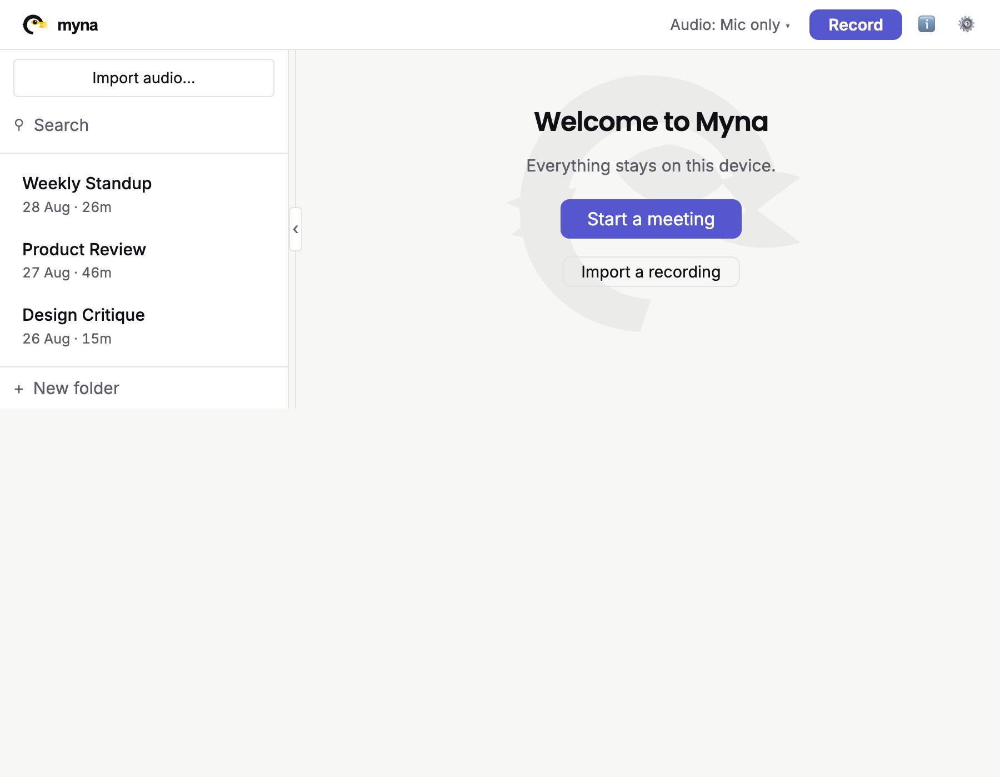

<picture>
  <source media="(prefers-color-scheme: dark)" srcset="myna-brand-kit/myna-logo-horizontal-dark.svg">
  
</picture>

**Capture, transcribe, and summarize your meetings — entirely on your machine.**

**100% local · No account · No cloud · Free forever (MIT)**

- **[⬇ Download & Install](#getting-started)**
- [Showcase](#showcase)
- [Features](#features)
- [Privacy](#privacy-recording--transcription-stay-local)
- [How Myna Compares](#how-myna-compares)
- [Roadmap](#roadmap)

  

  <strong>Hit Record. Get transcript + summary. Nothing leaves your Mac.</strong> 
  <a href="https://github.com/fmflurry/myna/releases">⬇ Download the .dmg</a> ·
  <a href="docs/usage.md">Usage guide</a>

## Why Myna?

Every meeting deserves a record. Cloud tools send your call
to someone else's servers or park a bot in your meeting.
Myna records locally, transcribes offline, and summarizes
on your own hardware. No account. No API calls. No vendor access.
Just results you own.

## Showcase

<table>
<tr>
<td width="50%" valign="top" align="center">
 
<strong>🎙 Record any source</strong> 
Mic, system audio, or mixed — with live status.
</td>
<td width="50%" valign="top" align="center">
 
<strong>💬 Live transcription</strong> 
Parakeet-TDT + Silero VAD, 25 languages.
</td>
</tr>
<tr>
<td width="50%" valign="top" align="center">
 
<strong>✨ One-click summaries</strong> 
Key Points, Action Items, Notes, Decisions.
</td>
<td width="50%" valign="top" align="center">
 
<strong>📚 Own your library</strong> 
Browse, rename, export. Stored in ~/myna/.
</td>
</tr>
</table>

> Screenshots are placeholders — see `docs/screenshots/*.png` (hero, recording, transcription, summaries, library).

## Features

### 🎙 Flexible capture

Three modes: **mic only**, **system audio only** (macOS 14.4+),
or **mixed mic + system** as separate tracks with speaker labels
(`Me` / `Others`). Device picker, clean start/stop/cancel,
graceful fallback to mic on older macOS.
See [docs/usage.md](docs/usage.md#choosing-a-capture-source).

- **Speaker labels** (`Me` for mic, `Others` for system) preserved
  in transcripts and summaries.

### 💬 Real-time transcription

**Parakeet-TDT v3** (640 MB int8 ONNX via sherpa-onnx),
**25 European languages**, Silero-VAD-segmented simulated streaming —
partial captions live, final punctuated results
after ~300 ms of silence.

### ✨ Local summarization

**Qwen2.5-7B-Instruct** (4.7 GB GGUF via embedded llama.cpp)
with four built-in templates — **Key Points**, **Action Items**,
**Meeting Notes**, **Decisions** — plus user-extensible JSON templates
(`templates/`, `{transcript}` `{duration}` `{title}` `{language}`).
Cancellable, multi-language output.

### 📚 Meeting library

List, rename, delete, view transcripts, retrieve summaries by template,
export to your filesystem. In-app model downloads with progress + cancel.
Tauri 2 shell (Rust + webview); macOS-first.

## Privacy: Recording & Transcription Stay Local

- **STT** runs locally (Parakeet-TDT via sherpa-onnx) — no audio sent anywhere.
- **Summaries** run locally (Qwen via llama.cpp) — no transcript leaves your machine.
- **Storage** is `~/myna/` (override `MYNA_DATA_DIR`) — nothing synced to the cloud.
- **No telemetry, no analytics.** **No bot joins your call.**
- **The only network call:** one-time model download from Hugging Face
  (~5.4 GB) via in-app **Download** or `./scripts/download-models.sh`.
  Then fully offline.

**Optional update checks** (off by default, opt-in): one GitHub check
per 24 h, IP address only, notify-only, never auto-install.
**Verify it yourself:** MIT-licensed — read the code, run offline.

## Free: Really Free

No card. No key. No sign-up. No seat limit. No trial. No meter.
Cloud vendors meter AI compute; Myna meters nothing —
your machine does the work.

## Getting Started

**macOS only** (Windows/Linux untested — see Roadmap).

1. Download the `.dmg` from [GitHub Releases](https://github.com/fmflurry/myna/releases),
   drag to Applications, launch.
2. Unsigned build (not notarized): if macOS says *"damaged"*,
   run `xattr -dr com.apple.quarantine /Applications/Myna.app`.
   Mic permission re-asks after each update (ad-hoc signature).
3. Onboarding: grant **Microphone** (always) and
   **Screen & System Audio Recording** (system/mixed only,
   macOS 14.4+, restart after granting).
   Click **Download** for models (~5.4 GB, one time).
   Decline update checks with no loss.
4. Hit **Record**, watch live captions, **Stop**, then **Summarize**.

From source: `npm install && npm --prefix ui install && npx tauri dev`.
Release: `npx tauri build`.
Full walkthrough: [docs/usage.md](docs/usage.md).

## How Myna Compares

| Feature | Myna | Otter.ai | Fireflies.ai | Granola | Fathom | Meetily | MacWhisper |
|---------|------|----------|------------|---------|--------|---------|-----------|
| **Runs on-device** | ✓ | ✗ | ✗ | ✗ | ✗ | ✓ | ✓ |
| **Bot joins call** | ✗ | ✓ | ✓ | ✗ | ✓ | ✗ | ✗ |
| **Account required** | ✗ | ✓ | ✓ | ✓ | ✓ | ✗ | ✗ |
| **Price floor** | Free | Free, then $8–17/mo | Free tier, then $10–18/mo | Free basic, then $14/mo | Free, then $15–20/mo | Free CE | Free tier (€64 Pro) |
| **License** | MIT | Proprietary | Proprietary | Proprietary | Proprietary | MIT | Proprietary |

Myna's edge: **privacy** (nothing leaves your machine) +
**zero paywall** (every feature open).
Pricing checked 2026-08:
[Otter.ai](https://otter.ai/pricing) · [Fireflies.ai](https://fireflies.ai/pricing) ·
[Granola](https://www.granola.ai/pricing) · [Fathom](https://www.fathom.ai/pricing) ·
[Meetily](https://github.com/Zackriya-Solutions/meetily) ·
[MacWhisper](https://www.macwhisper.com/)

## Roadmap

*Direction, not commitment.*

### Near-term

- Speaker diarization
- Global search across meetings
- Export (Markdown/TXT/SRT/VTT/PDF, Obsidian/Notion)
- Windows/Linux support
- Model picker (7B/14B+)
- Custom vocabulary

### Mid-term

- Calendar integration
- App auto-detect
- Local RAG chat over meetings
- True streaming transcription
- Whisper fallback (99 languages)
- PII redaction
- Template sharing
- Transcript editor

### Long-term

- iOS companion
- Encrypted sync
- Speaker enrollment
- Local MCP server
- Team workspace
- Analytics
- Live captions + translation

## Contributing & License

**MIT** — see [LICENSE](LICENSE).

Third-party licenses:

- Parakeet-TDT weights — **CC-BY-4.0**
- sherpa-onnx runtime — **Apache-2.0**
- llama.cpp runtime — **MIT**
- Qwen2.5-Instruct — **Qwen research agreement**
  ([Hugging Face](https://huggingface.co/Qwen/Qwen2.5-7B-Instruct-GGUF))

Resources:

- [Usage Guide](docs/usage.md)
- [Architecture](docs/stack-proposal.md)
- [ADRs](docs/adr/)
- [Custom Summary Instructions](docs/custom-summary-instructions.md)

Questions? Open an issue.
Built entirely with AI ([configs](https://github.com/fmflurry/settings-opencode)).
Optional tip: [paypal.me/fmflorianmichel](https://paypal.me/fmflorianmichel).
